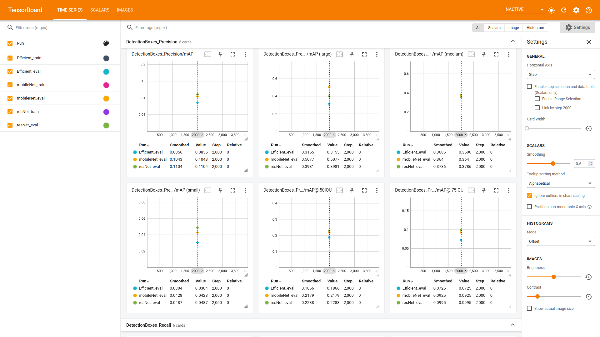
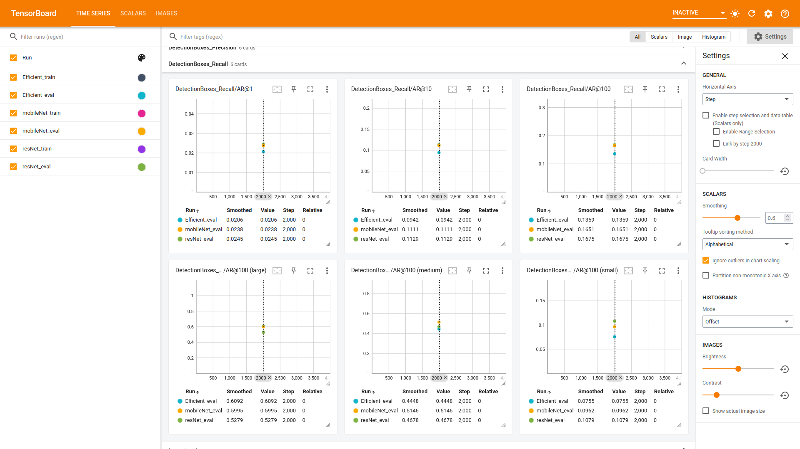
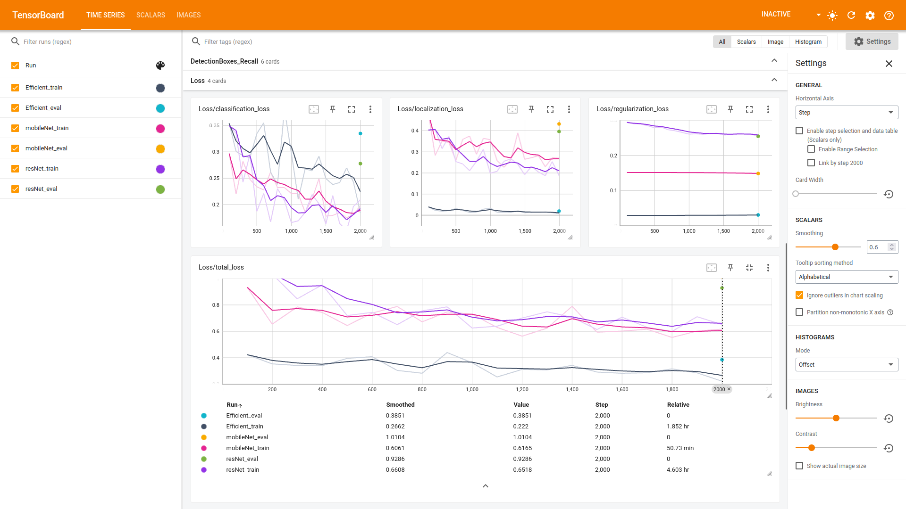

# Object detection in an urban environment

In this project, it will be demonstrated how to train an object detection model using the [Tensorflow Object Detection API](https://tensorflow-object-detection-api-tutorial.readthedocs.io/en/latest/index.html) and [AWS Sagemaker](https://aws.amazon.com/sagemaker/). At the end of this project, generated video with detection will be produced such as the one below. 

    

## Project Introduction

The objective of this project is to utilize the skills learned in this course to implement a pretrained neural network for detecting and classifying objects using Waymo data. The dataset for the project includes annotated images of cyclists, pedestrians, and vehicles in urban environments. The project aims to apply the learned skills to detect and classify objects in the provided dataset.

During this project, you will utilize TensorBoard to monitor the training process of your model and determine when to terminate it. Additionally, you will experiment with various hyperparameters to enhance the performance of your model.

The TensorFlow Object Detection API will be utilized in this project to allow for deployment of the model and generate predictions on images submitted to the API. Furthermore, code will be provided to enable the creation of a brief video showcasing the model's predictions.

## Usage

This repository contains two notebooks:
* [1_train_model](1_model_training/1_train_model.ipynb): this notebook is used to launch a training job and create tensorboard visualizations. 
* [2_deploy_model](2_run_inference/2_deploy_model.ipynb): this notebook is used to deploy your model, run inference on test data and create a gif similar to the one above.

First, run `1_train_model.ipynb` to train your model. Once the training job is complete, run `2_deploy_model.ipynb` to deploy your model and generate the animation.

Each notebook contains the instructions for running the code, as well the requirements for the writeup. 
>Note: Only the first notebook requires a write up. 

## Steps Taken
In the initial phase of the project, an efficient model was utilized and subsequently trained and tested. Following this, MobileNet and ResNet models were also employed and underwent the same training and testing processes. Each model was adjusted accordingly in their respective pipline.config files. The outputs generated from the trained models were then analyzed and evaluated.

* EfficientDet D1 640x640 (Default)
* SSD MobileNet V2 FPNLite 640x640
* Faster R-CNN ResNet50 V1 640x640

## EfficientDet Results 

### mAP
/efficient_mAP.png)

### Recall
/efficient_recall.png)

### Total Loss
/efficient_totalLoss.png)

## MobileNet Results 

### mAP
/mobileNet_mAP.png)

### Recall
/mobileNet_recall.png)

### Total Loss
/mobileNet_totalLoss.png)

## ResNet Results 

### mAP
/resNet_mAP.png)

### Recall
/resNet_recall.png)

### Total Loss
/resNet_totalLoss.png)

## Comparison
comparison to choose the best model to deploy 

### mAP

### Recall

### Total Loss

as shown in the figures above, the mobilNet has the best results although it was expected that the resNet would have the best results.

## Deployment
/output(MobileNet).gif)

                                    mobileNet output

## Discusson 

After conducting various experiments on the standard efficient model during training and validation, it was observed that training without augmentations resulted in the model overfitting. The mAP values were inconsistent due to an oscillating loss curve, indicating that the training landscape had not converged correctly. Although changing the LR rate/optimizer helped, data augmentation provided a more stable loss curve. For the two other variants in the pipeline, a standard ResNet 50 was used as the baseline model to assess performance in terms of overfitting on validation without augmentation. Similar to the efficient net, ResNet suffered from comparable issues without augmentation. However, MobileNet with Masked RCNN showed slightly better loss convergence than both efficient net and ResNet. As further follow-ups, checking the LR decay, optimizer, annealing factors, more augmentations, and trying custom models were suggested.

## Useful links
* The Tensorflow Object Detection API tutorial is a great resource to debug your code. This [section](https://tensorflow-object-detection-api-tutorial.readthedocs.io/en/latest/training.html#configure-the-training-pipeline) in particular will teach you how to edit the `pipeline.config` file to update
your training job.

* [This blog post](https://aws.amazon.com/blogs/machine-learning/training-and-deploying-models-using-tensorflow-2-with-the-object-detection-api-on-amazon-sagemaker/) teaches how to label data, train and deploy a model with the Tensorflow Object Detection API and AWS Sagemaker.
